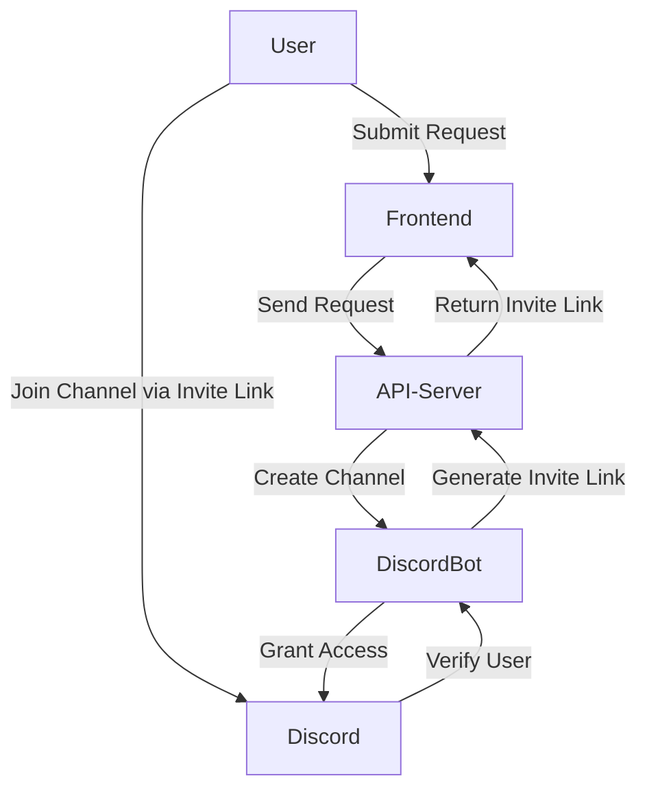

# discord-invite-bot

## Overview
**discord-invite-bot** is a versatile and secure bot designed to automate the creation of private Discord channels based on user input or specific criteria. Whether you're managing an exclusive community, setting up team channels, or offering custom Discord experiences, this bot can be tailored to fit a wide range of use cases. The bot integrates seamlessly with Discord to create channels, generate invite links, and ensure only the correct users can join the channels.

## Setup

### Prerequisites
- Node.js (v14 or higher)
- Discord Bot Token
- Docker (optional for containerized deployment)

### Installation
1. **Clone the Repository:**
   ```bash
   git clone https://github.com/yourusername/discord-invite-bot.git
   cd discord-invite-bot
   ```

2. **Install Dependencies:**
   ```bash
   npm install
   ```

3. **Environment Variables:**
   Create a `.env` file in the root directory and populate it with the following variables:
   ```env
   DISCORD_BOT_TOKEN=your_discord_bot_token
   CHANNEL_PREFIX=channel-
   ```

4. **Start the Bot:**
   ```bash
   npm start
   ```

5. **Docker (Optional):**
   If you prefer to run the bot in a Docker container:
   ```bash
   docker build -t discord-invite-bot .
   docker run -d --env-file .env discord-invite-bot
   ```

## Architecture

The architecture of the **discord-invite-bot** is designed to securely interact with Discord, create channels, and manage user invites based on various configurable criteria.

### Components:
1. **Discord Bot:**
   - Interacts with the Discord API to create private channels, generate invite links, and perform user verification.
   
2. **API Server:**
   - Serves as the middleware between the frontend and the Discord Bot, ensuring secure communication and data validation.
   
3. **Frontend (Optional):**
   - Provides an interface for users to trigger channel creation and handle submissions.

## Mermaid Diagram of Architecture



## Industry Standards

- **Secure API Communication:** All interactions between the frontend, API server, and Discord bot are secured with HTTPS and authentication tokens.
- **Rate Limiting:** API endpoints include rate limiting to prevent abuse.
- **Input Validation:** The bot implements strict validation on all user inputs to prevent unauthorized access or malformed requests.
- **Logging and Monitoring:** Logs are maintained for all channel creation and user verification activities, allowing for auditing and incident management.

## API Usage

### Endpoints:

1. **POST /api/create-channel**
   - **Description:** Creates a private Discord channel based on user input.
   - **Request:** 
     ```json
     {
       "discordHandle": "Username#1234"
     }
     ```
   - **Response:**
     ```json
     {
       "inviteLink": "https://discord.gg/..."
     }
     ```

2. **POST /api/verify-user**
   - **Description:** Verifies if the user joining the Discord channel matches the provided criteria.
   - **Request:** 
     ```json
     {
       "channelName": "channel-Username",
       "joiningHandle": "Username#1234"
     }
     ```
   - **Response:**
     ```json
     {
       "verified": true/false
     }
     ```

## Contributor

- **Lucas Liao** - [GitHub](https://github.com/yourusername)

## License

This project is licensed under the MIT License - see the [LICENSE](LICENSE) file for details.
